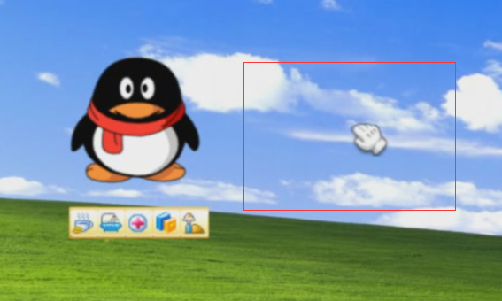
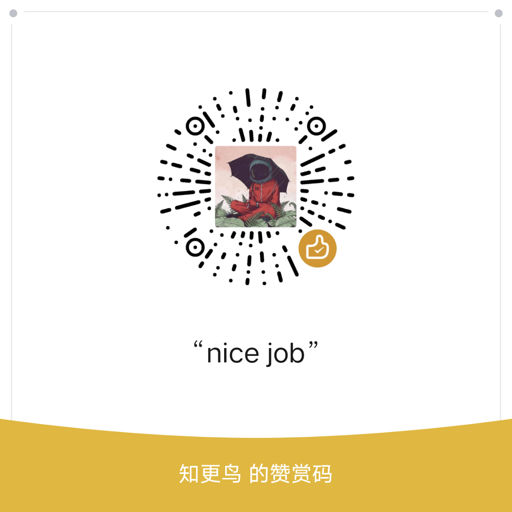

# QQPet

#### 简介
    我用ruffle-rs和react复刻了qq宠物的基础功能模块，现在你可以在任何浏览器上直接访问而无需安装任何软件(包括flash)。
    点击访问 https://icecreamheadache.gitee.io/  若长时间未显示，等待加载完成后重新刷新即可

    为防止恶意滥用，需源代码请通过邮箱与联系我

#### 现有的问题
(小白请忽略)
1. 由于ruffle二次加载swf动画时，会先delElement再createElement，从而导致不同动作切换存在明显的割裂感。
2. 由于ruffle遮挡，仅能提供宠物在右侧方向区域内的拖拽功能

3. 仅提供成长值、饥饿值、清洁值变化，同一电脑的同一浏览器下最长保存一周的数据（每次打开可延续一周），超过一周即重置。
4. 由于极度缺少qq宠物客户端原文件及相应文本信息（如食品、日用品等的图鉴：具体数值与元宝），大部分源文件仅来源于QQ宠物单机版（亚洲飞鹰 v3.7）与百度经验的图片，故未提供元宝数值，看病、学习与打工也不对宠物数值产生任何影响，目前项目难以进一步深入。

#### 支持
如果您想对该项目表示支持或提供帮助，您可以
1.  请我喝一杯奶茶或者吃一顿疯狂星期四
 
2.  提供qq宠物客户端原文件或相关物品信息规则，请发送至我的邮箱751791623@qq.com

#### 其他
    WinXP源自于项目Github上ShizukuIchi的项目winXP，在此对ShizukuIchi、亚洲飞鹰等作者表示表示感谢。
